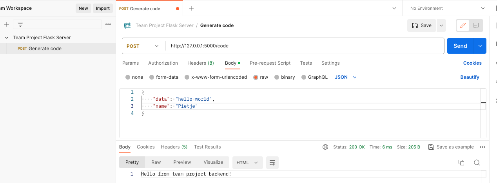

# Flask API

This folder contains the Flask server that will serve as the API for our frontend. For now, the API has one endpoint `/code`, which will be used to generate Plotly code from the JSON object which will be sent to it by the frontend.

## Setup Instructions

The setup is handled by the `./startup.sh` file. Just run the following in your terminal.

```sh
./startup.sh
```

The server should now be accessible on `http://127.0.0.1:5000`

## Testing/debugging with Postman

- **POST** `/code`: Accepts JSON data with the fields described in the Pydantic model.
  
